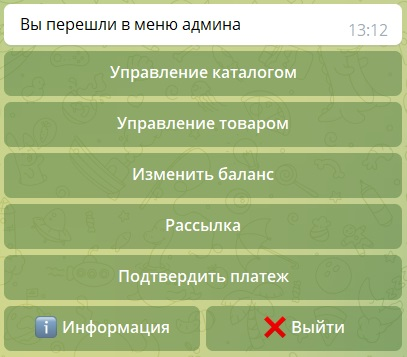

<h1 align="center">
Tg Sgop
</h1>
<p align="center">
Этот телеграм бот создан для покупки цифровых товаров с оплатой при помощи криптовалюты
</p>

<h1>Пример работающего бота</h1>
<a href="https://t.me/Igcapitalbot">Тык</a>

# Установка
```
git clone https://github.com/DmitrI2488/Tg-bot.git
cd Tg-bot/shop
pip install telebot
pip install pyTelegramBotApi
pip install requests
python3 main.py
```
*Необходимо задать токен бота в settings bot-token, id админа и каналы в которые будут отправляться чеки и сообщения о покупке*

<h1 align="center">
Функционал бота
</h1>
<h3>Для пользователя</h3>
<ul>
    <li>Выбор товаров для покупки</li>
    <li>Пополнение баланса через криптовалюту</li>
	<li>Связь с тех поддержкой</li>
	<li>Просмотр приобретенных товаров</li>
</ul>
<h3>Для администратора</h3>
<ul>
    <li>Изменение бланаса пользователя</li>
    <li>Подтверждение пополнения</li>
    <li>Добавление и редактирование товаров</li>
    <li>Создание каталогов</li>
    <li>Отправление рассылки</li>
</ul>


## Пополнение баланса

*Так как оплата в данном боте реализована через криптовалюту, то мы используем api CryptoBot*

*Пользователь также может выбрать прямой перевод и отправить на указанный канал чек, после чего администратор через админ панель сможешь подтвердить пополнение*


</br>
</br>


Описание:
```
Если пользователь захочет выбрать оплату через cryptobot
То тогда он укажет сумму в рублях, а ему будет в ответ
будет передана ссылка на покупку
```

## Приобретение товара

Когда пользователь выберет нужный ему товар, он сможет его приобрести со своего счета в боте


*После чего администратору в канал придет уведомление о покупке*


<h1>Функционал Администрора</h1>

*Для администратора доступна панель по команде /admin*



Здесь он может подтверждать или изменять баланс, проводить рассылку своим сообщением по подписчикам бота, изменять состав каталога


<h1>Программные средства и технические особоенности</h1>
<h3>Инструменты разработки:</h3>
<ul>
<ul>
    <li>Python 3</li>
    <li>SqLite3</li>
    <li>pyTelegramBotApi</li>
    <li>telebot</li>
    <li>CryptoBot Api</li>
    <li>requests</li>   
</ul>
</ul>
<h3> Технические особенности </h3>
<ul>
    <li>Доступность на любом устройстве где есть телеграм</li>
</ul>

## Остались вопросы?
* Задайте их [Telegram](https://t.me/dmitri2488)


